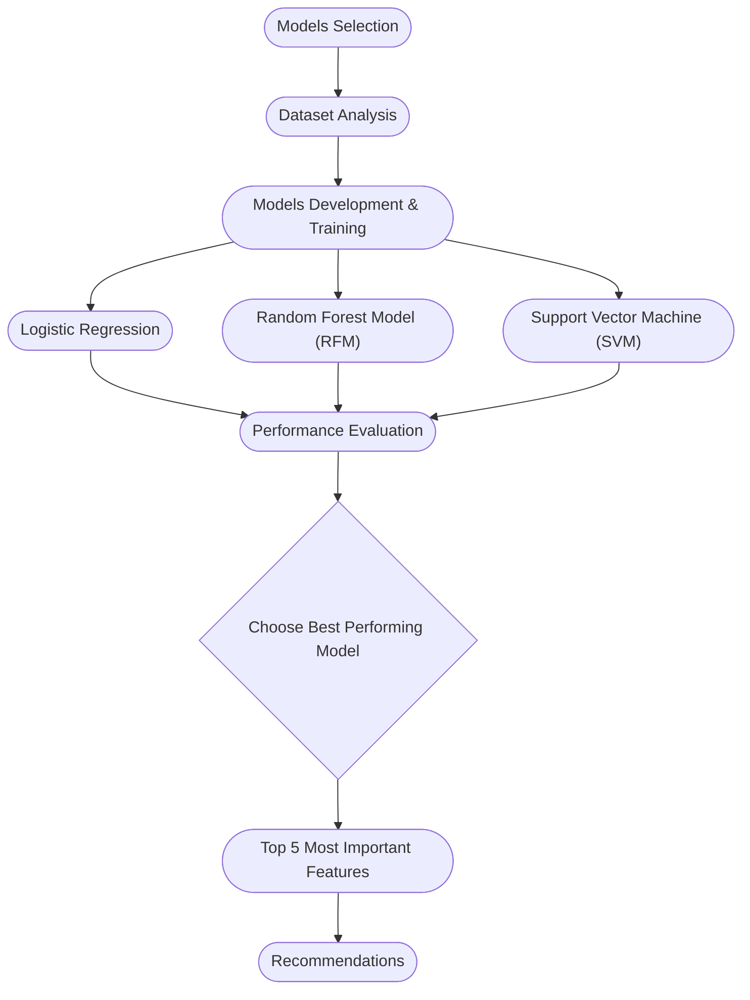

# Improving Breast Cancer Diagnostics Project

Our team is dedicated throughout this project to improve the breast cancer diagnostics leveraging machine learning capabilities provided by the latest technologies. 
Our project will have the below scope:
- Choose 3 machine learning models and evaluate thier capabilities in predicting the diagnostics of patients as benign or malignant.
- Investigate and engineer a set of features best to perform accuracy and optimized prediction.
- Provide a list of recommendations and action items to project stakehlders for them leveraging the data-driven solution to enhance cancer diagnostics.

> [!NOTE]
> This initiative is considered to be a research project. It is a prelude to a pilot project to be implemented at hospitals and cancer clinics with the consideration of partial or full implementation of recommendations.

## Content

Business Case
Stakeholders
Project Goals & Milestones
Project Reporting
Considerations and Risk Management
Recommendations
Team Members

# Business Case
Our business case is focused on leveraging data using machine learning models and methodologies to investigate and find the features of a breast mass which are the most predictive of breast cancer diagnosis.

# Stakeholders
After investigating and analyzing the medical field, we had found that below are the primary stakeholders benefitting from this initiative:
|Stakeholder|Interest|
|:-----:|------|
|Patients|Patients are at the top of the list as their life is depedent on the accuracy of the diagnosis. The more accuraly diagnozed, patients will receive the required treatment in the shortest period of time, and may be the reason for saving their lives in certain cases.|
|Clinical doctors|Their interest in the project is knowing the most important features required to predict the cancer will increase the accuracy of diagnosis whether its malignant or benign. Which will lead to better treatment/management for the patients.|
|Medical Equipment Manufactors|This initiative will enable the manufacturers building more optimized diagnostic panels for collecting the data.|
|Hospital Management|The management are interested in reducing the diagnostics costs and consequentally the patient's treament. This goal of this initiative is firmly aligned with this interest as finding the most important features will result in a more optimized diagnostic approach. This will consequently lead to more accurate diagnostics, better treatment and reduced cost.|
|Hospital's Legal department | The more optimized diagnostics approach will increase the accuracy of the diagnostic, thereby, avoiding the lawsuits against doctors and the hospital due to consequences of false diagnosis.|
|Ministry of Health|The accurate disgnostics will reduce the cost and the expenses paid by Public health budget.|

# Project Goals
The goal of the project is to identify features that are most predictive of malignant cancer in the Wisconsin Breast Cancer dataset. The dataset features approximately 30 predictor variables associated with each sample. Therefore, The project team shall aim to: 
 - Explore various models to identify 3 models best fit for the problem.
 - Build 3 models using different machine learning techniques and compare their performance.
 - Identify 3-5 features that are most definitive contributor to the model performance from multiple different models.

# Project Flow Chart
To have a better visualization of the project phases and milestones, our project team had created the below flow chart. In every section, the project team will provide the detailed analysis following the logical flow of the process:

# Project Report (Finding & Results)
In this section, our team had listed the project milestones along with the results and the methodologies that we had used to follow though and meet the project goals.

## Models Selection
Our project team had complete a research on the qualified machine learning models to be using for classifying the dataset. The team had listed 5 potential ML models listed below:
  - logistic regression
  - Support Vector Machine (SVM)
  - Random Forest Model (RFM)
  - AutoGloun
  - LightGBM

Among these listed models, the team had chosen 3 models for our project. These models are the best fit for small datasets and we will conduct our research and analysis in the upcoming sections:
 - logistic regression
 - Support Vector Machine (SVM)
 - Random Forest Model (RFM)

> [!NOTE]
> The project team read this article that mentioned the comparison between the 5 models that are most suitable and fit for this dataset. The article is found [here](https://www.data-cowboys.com/blog/which-machine-learning-classifiers-are-best-for-small-datasets)

## Data Analysis
This dataset is representing 30 features for 569 samples derived from digitized images of fine-needle aspirate (FNA) tests performed on breast cancer. These features are numerical and continiuos, also, our team had confirmed that none of these features have any missing values.
Our target variable (the depednent variable) is Diagnosis variable which has either of the below values:
- M: for malignant
- B: for benign

> [!NOTE]
> The dataset was downloaded and its analysis were done based on information provided in [Breat Cancer Wisconsin (Diagnostic) paper](https://archive.ics.uci.edu/dataset/17/breast+cancer+wisconsin+diagnostic)

The team had conducted analysis on the dataset which includes the below:
1. Ensure that the dataset is clean and had no missing values.
2. Demonstrated the relationships between the features themselves and also with the target variable.

Add the features correlation removal.

## Models Development & Training
The project team had development and trained the three models on the dataset. Every section below will show the Python code used for every model and the performance criteria used to select the best performing model.

### Logistic Regression

### Random Forest Model (RFM)

### Support Vector Machine (SVM)

## Performance Evaluation
List which model is chosen ( which is RFM)

## Choose Best Performing Model
This section defined the criteria the project team had used to select the model (The How!), and provide the technical justification (The Why!).
Please include the CV 

## Top 5 Most Important Features

# Risks Identified & Considerations

The project was a great learning exercise and it truly highlighted how building effective machine learning models goes far beyond algorithm selection. Understanding the data source, identifying its limitations, managing bias and correlation, and selecting the right evaluation metrics are all critical steps toward developing responsible, trustworthy models. Below are some of the risk that we identified with our approach:

1. Sample Dataset Limitations:
The Wisconsin Diagnostic Breast Cancer (WDBC) dataset, commonly used in medical research, has several notable limitations. It includes only 569 samples, which restricts its representativeness and can lead to less reliable results. 
The dataset also has a moderate class imbalance, with 357 benign and 212 malignant cases, potentially skewing outcomes toward the majority class if not addressed. 
Additionally, it originates from a single institution—the University of Wisconsin Hospitals—introducing geographical and institutional bias that may not reflect diverse patient populations.

The dataset lacks imaging data, providing only precomputed measurements from digitized fine needle aspirate (FNA) samples, such as texture, smoothness, and symmetry, rather than raw images or histopathology slides. 
This limits its applicability for advanced diagnostic techniques. It also excludes patient demographic details, such as age, genetic factors, or family history, which are critical for personalized diagnostics or subgroup analysis.

2. High Feature Correlation:
The correlation heatmap shows strong relationship between some of the features in the dataset. Most notably, radius_mean, perimeter_mean, and area_mean are highly correlated with each other, forming a distinct cluster with correlation coefficients close to 1. Similarly, their corresponding “worst” and “SE” measures also show strong correlations. Features such as concavity_mean, concave_points_mean, and compactness_mean are also correlated, indicating they may essentially represent the same information. 
Texture-related features and measures like fractal_dimension_mean and symmetry_se show relatively weak correlations with most other variables. These weaker correlations may point to independent information that could be valuable in prediction models.
This strong multicollinearity among certain groups suggests dimensionality reduction techniques or feature selection might be beneficial for reducing redundancy in subsequent modeling.

3. Missing Human-centered Attributes from the Data:
While the dataset provides detailed physical features of the tumor cells, it lacks important features such as patient history, genetics, lifestyle factors, and dietary habits. These human-centered attributes can significantly influence diagnostic outcomes and their absence could limit the real-world accuracy and fairness of the model.

4. Measurement and Data Acquisition Bias:
The features in this dataset are derived from digitized images, meaning that inconsistencies in measurement devices, individuals involved, resolution and lighting could also affect data quality. This variability can introduce noise, reducing the reliability and repeatability of predictions.

5. Model Selection and Evaluation Strategy:
While the original study used MSM-T, we evaluated several modern models, including logistic regression, decision trees and support vector machines (SVM). To handle uncertainty and improve robustness, we performed cross-validation and hyperparameter tuning across different algorithms.
In a medical context where accuracy alone is not enough, we used metrics like precision, recall, F1-score, and ROC-AUC, especially to minimize false negatives, where a malignant tumor might be misclassified as benign—an outcome that carries serious clinical risk.

6. Dependency on Data Quality:
Most machine learning models are highly sensitive to the quality and structure of the training data. Noise, missing values, and inconsistent feature scaling can significantly reduce model performance. We ensured rigorous data cleaning, normalization, and outlier handling in our preprocessing pipeline to mitigate this risk.

# Recommendations
- Provide a list of actionable items to be addressed by your audience, for example, for doctors.
- Based on the importance of features, highlight the features and what should be done or considered in measuring them.

- If we have more time on the project, what can we do more/enhance?

# Team members
Below are our team members:
|Name|GitHub|Roles|Contribution Video|
|:--:|:--:|:--:|:--:|
|Sanjeev Budhathoki|https://github.com/budsans|Models Development|
|Omar Alfaqih|https://github.com/omaralfaqih6/|, Documentation, Model Optimization|
|Azhar Hasan|https://github.com/azharhasan|Model Optimization, Risk Analysis|
|Olalekan Oni |https://github.com/oniolalekan |Result Analysis | 

# Further Readings
Below are the links mentioned in this article for further readings and advanced research.
