# Improving Breast Cancer Diagnostics Project


Breast cancer remains the most commonly diagnosed malignancy among women worldwide and is a leading cause of cancer-related mortality, accounting for over two million new cases annually. Accurate early diagnosis is essential for improving patient outcomes and reducing treatment-associated morbidity. Traditional diagnostic methods-relying on imaging (e.g., mammography, ultrasound) followed by biopsy—are time-consuming, resource-intensive, and may yield ambiguous results, particularly in women with dense breast tissue. These limitations can lead to diagnostic delays, unnecessary biopsies, or missed malignancies, especially in settings with limited access to specialized radiologists or pathologists.¹

Machine learning (ML) models offer a promising solution to these challenges by enabling automated, fast, and accurate classification of breast tumors using structured clinical or imaging data. Unlike traditional rule-based systems, ML algorithms can learn complex patterns in large datasets and continuously improve with more data. 

The objective of this analysis is to develop and evaluate classification models for predicting breast cancer diagnosis using the Wisconsin Diagnostic Breast Cancer (WDBC) dataset. 

## Content

[Business Case](https://github.com/omaralfaqih6/breast_cancer_wisconsin/blob/main/README.md#business-case)<br>
[Stakeholders](https://github.com/omaralfaqih6/breast_cancer_wisconsin/blob/main/README.md#stakeholders)<br>
[Project Goals](https://github.com/omaralfaqih6/breast_cancer_wisconsin/blob/main/README.md#project-goals)<br>
[Project Flow Chart](https://github.com/omaralfaqih6/breast_cancer_wisconsin/blob/main/README.md#project-flow-chart)<br>
[Project Report](https://github.com/omaralfaqih6/breast_cancer_wisconsin/blob/main/README.md#project-report)<br>
[Risk Management](https://github.com/omaralfaqih6/breast_cancer_wisconsin/blob/main/README.md#risks-identified--considerations)<br>
[Recommendations](https://github.com/omaralfaqih6/breast_cancer_wisconsin/blob/main/README.md#recommendations)<br>
[Future Considerations](https://github.com/omaralfaqih6/breast_cancer_wisconsin/blob/main/README.md#future-considerations)<br>
[Team Members](https://github.com/omaralfaqih6/breast_cancer_wisconsin/blob/main/README.md#team-members)<br>

# Project Showcase Presentation
Our presentation is hosted in [this location.](./report/improving_breast_cancer_diagnostics_project.pptx)


# Business Case
Our business case focuses on leveraging machine learning models and methodologies to identify the breast mass features most predictive of a breast cancer diagnosis.

# Stakeholders
Our analysis identified the following primary stakeholders who will benefit from this initiative: 

|Stakeholder|Interest|
|:-----:|------|
|Patients|Patients are the most important stakeholders, as their lives depend on accurate diagnosis. Timely and precise detection enables faster treatment, which can be life-saving in many cases.|
|Doctors|Doctors are interested in identifying key features that improve diagnostic accuracy, enabling better treatment and patient outcomes.|
|Medical Equipment Manufactors|This initiative will help manufacturers design more optimized diagnostic panels for data collection.|
|Hospital Management|The management is interested in reducing diagnostic and treatment costs. This initiative aligns with that goal by identifying key features to enable a more optimized, accurate, and cost-effective diagnostic approach..|
|Hospital's Legal department | An optimized and evidence based diagnostic approach improves accuracy, reducing the risk of lawsuits from false diagnoses.|
|Ministry of Health|Accurate diagnostics will reduce costs and ease the burden on the public health budget.|

# Project Goals
This project aims to identify the most predictive features of malignant cancer in the Wisconsin Breast Cancer dataset, which contains around 30 predictor variables per sample. Therefore, The project team shall aim to: 
 - Explore various models to identify 4 models best fit for the problem.
 - Build 4 models using different machine learning techniques and choose the best based on performance.
 - Identify 3-5 features that are the most definitive contributor to the model performance from multiple different models.

# Project Flow Chart
This flowchart below highlights our team's approach. Each section in this report provides further details on each of these elements in order:

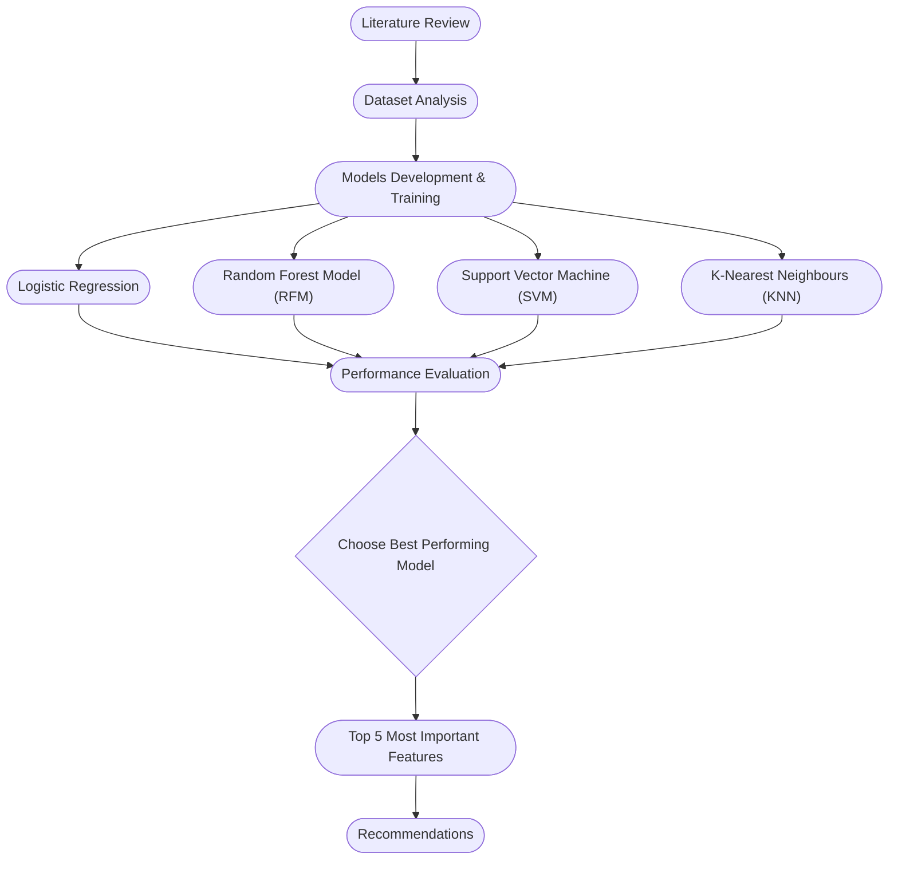
# Project Report

## Literature Review
Based on lierature review, our project team qualified following machine learning models popularly used by data scientists on classification problems with small datsets. More details in the note below. The 6 potential ML models thus qualified are listed below:
  - Logistic Regression
  - Support Vector Machine (SVM)
  - Random Forest Model (RFM)
  - K-Nearest Neighbours (KNN)
  - AutoGloun
  - LightGBM

Out of the qualified models well suited for small datasets, the project team selected these four because they were covered in the coursework and thus executable within the project timeframe:
 - Logistic Regression
 - Support Vector Machine (SVM)
 - Random Forest Model (RFM)
 - K-Nearest Neighbours (KNN)

Our research and analysis using these models will follow in the upcoming sections.

## Dataset Analysis
The Wisconsin Diagnostic Breast Cancer (WDBC) dataset was designed to distinguish between benign and malignant tumors using image-derived features. It contains 569 patient records and 32 variables, including an ID, diagnosis label, and 30 numeric features computed from fine‑needle aspirate (FNA) images of breast masses. Each of the 30 features represents three summary statistics (mean, standard error, and the “worst” or largest value) across 10 nuclear characteristics such as radius, texture, perimeter, area, smoothness, compactness, concavity, concave points, symmetry, and fractal dimension.

[!NOTE]
> The project team read this article that mentioned the comparison between the 5 models that are most suitable and fit for this dataset. The article is found [here](https://www.data-cowboys.com/blog/which-machine-learning-classifiers-are-best-for-small-datasets)


### Distribution of Diagnosis Outcomes
The dataset consists of a total of 569 instances of breast cancer, categorized into malignant (M) and benign (B) tumors. Out of these, 357 cases (62.7%) are benign and 212 cases (37.3%) are malignant. 
<p align="center">
  
</p>

- M: for malignant
- B: for benign

> [!NOTE]
> The dataset was downloaded and its analysis were done based on information provided in [Breat Cancer Wisconsin (Diagnostic) paper](https://archive.ics.uci.edu/dataset/17/breast+cancer+wisconsin+diagnostic)

### Dataset Cleanup Check
An assessment of missing values across all variables in the dataset revealed that there are no missing values in any column. This ensures the dataset is complete and suitable for downstream analyses without the need for imputation or data cleaning related to missingness.

### Distribution of Features
Histograms of all 30 numerical features reveal a variety of distribution shapes, highlighting key characteristics of the dataset. Most features, including area_mean, perimeter_mean, radius_mean, and their corresponding worst and standard error measures, show right-skewed distributions, indicating a concentration of smaller values with a long tail toward larger values. Similarly, features like concavity_mean, compactness_mean, and concave_points_mean are reflecting that a majority of tumors exhibit low levels of these measures. Some other features such as texture_mean, symmetry_mean, and fractal_dimension_mean are more symmetrically distributed. 

### Correlation Analysis
The correlation heatmap shows a strong relationship between some of the features in the dataset. Most notably, radius_mean, perimeter_mean, and area_mean are highly correlated with each other, forming a distinct cluster with correlation coefficients close to 1. Similarly, their corresponding “worst” and “SE” measures also show strong correlations. Features such as concavity_mean, concave_points_mean, and compactness_mean are also correlated, indicating they may essentially represent the same information. 
Texture-related features and measures like fractal_dimension_mean and symmetry_se show relatively weak correlations with most other variables. These weaker correlations may point to independent information that could be valuable in prediction models. Overall, the strong correlation among some of the features suggests dimensionality reduction techniques or feature selection might be beneficial for reducing redundancy and or reducing multicollinearity issues in the subsequent modeling.
<p align="center">
  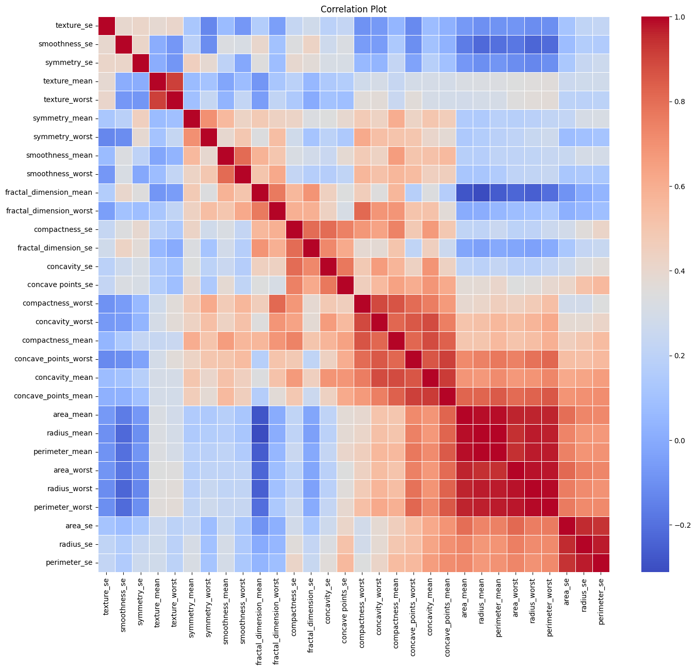
</p>

#### Correlation between features by cancer status
The plot shows the relationships among the five most correlated features with breast cancer diagnosis (radius_mean, perimeter_mean, radius_worst, area_worst, and perimeter_worest), with samples stratified by diagnostic outcome (malignant vs. benign). Briefly, tumour characteristics such as, radius_mean, perimeter_mean, and area_worst showed a strong linear or almost linear association with the malignancy, consistent with the expectation that larger tumor dimensions correlate with malignancy. Additionally, malignant cases predominantly occupied higher value ranges across all features compared to benign cases, with minimal overlap in distributions. This suggests robust discriminative power of these features.
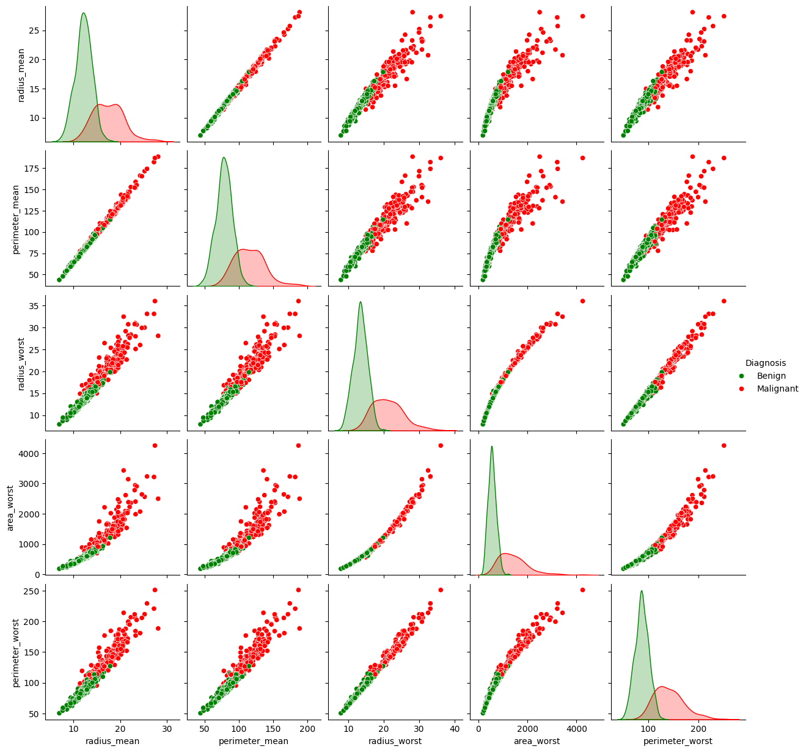

### Distribution of features by cancer status
The boxplot shows the distribution of 12 features between malignant and benign breast tumor cases. Overall, almost all the features except the fractal_dimension_mean, showed higher values in malignant cases compared to benign cases.
<p align="center">
  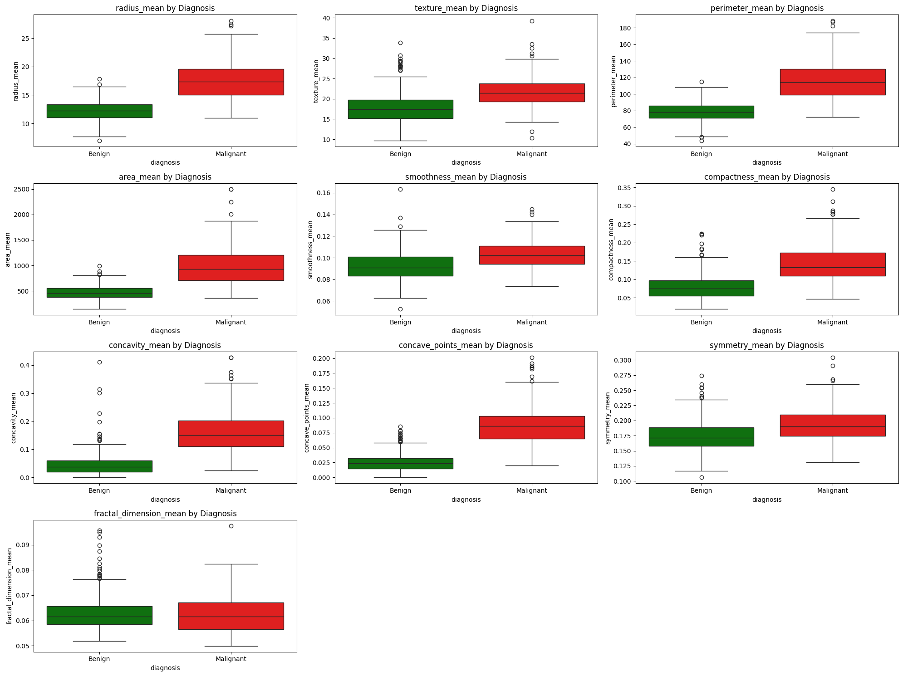
</p>

## Model Development & Training
In the exploratory analysis, we observed that several features in the dataset were highly correlated. This high correlation indicates strong relationships among certain features, which can lead to redundancy in the dataset and could also introduce multicollinearity issues during model training or downstream analysis. Multicollinearity can distort the interpretation of model coefficients, particularly in models like logistic regression, and may also lead to overfitting in more complex models. To address this, we implemented a correlation thresholding approach where one feature from each highly correlated pair (correlation > 0.90) was removed. This step helps in ensuring that each retained feature contributes unique information to the model while also improving interpretability and robustness of our predictive models.

As mentioned in the literature review, We shorlisted four commonly used classifiers: Logistic Regression, Random Forest, Support Vector Machine (SVM) and KNN for this project. We trained each model on the preprocessed training dataset and assessed their performance on the test set. 

The performance of a classification model was evaluated using the following metrics:

### Precision:
The proportion of correctly predicted positive observations to all predicted positives. High precision indicates a low false positive rate. It is measured as:

$Precision$ = $\frac{\text{True Positives}}{\text{True Positives} + \text{False Positives}}$

### Recall: 
The proportion of correctly predicted positives out of all actual positives. It is measured as:

$Recall$ = $\frac{\text{True Positives}}{\text{True Positives} + \text{False Negatives}}$

### F1-Score:
The harmonic mean of precision and recall. It balances both metrics and is especially useful when classes are imbalanced. It is measured as:

$F1$ = $\frac{2 \times \text{Precision} \times \text{Recall}}{\text{Precision} + \text{Recall}}$

### AUROC Curve:
Receiver Operating Characteristic Curve is a graphical representation of the diagnostic ability of a binary classifier by plotting the True Positive Rate (Recall) against the False Positive Rate ($FPR$ = $\frac{\text{FP}}{\text{FP} + \text{TN}}$) at various threshold levels. A model that performs better than random guessing will have a curve that bows towards the top-left corner. AUC (Area Under the ROC Curve) is a value summarizing the entire ROC curve. AUC ranges from 0 to 1 and a higher AUC value reflects better model performance.² 

The subsections below describe the Python implementation and evaluation approach for each model.

### Logistic Regression
The Logistic Regression model was trained using scikit-learn's LogisticRegression class. The data was split using stratified train-test splitting to ensure balanced class representation. Feature scaling was applied to normalize the inputs.
<p align="center">
  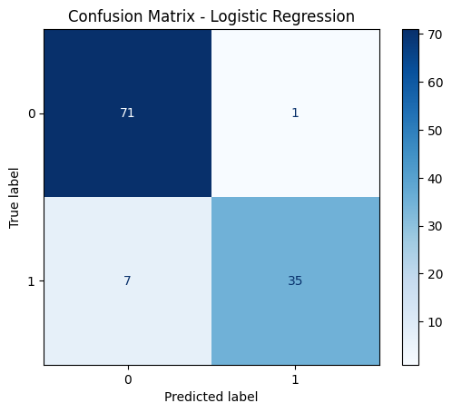
</p>

### Random Forest Model (RFM)
The Random Forest Classifier was trained using scikit-learn’s RandomForestClassifier. This ensemble method uses multiple decision trees to improve prediction accuracy and control overfitting.
<p align="center">
  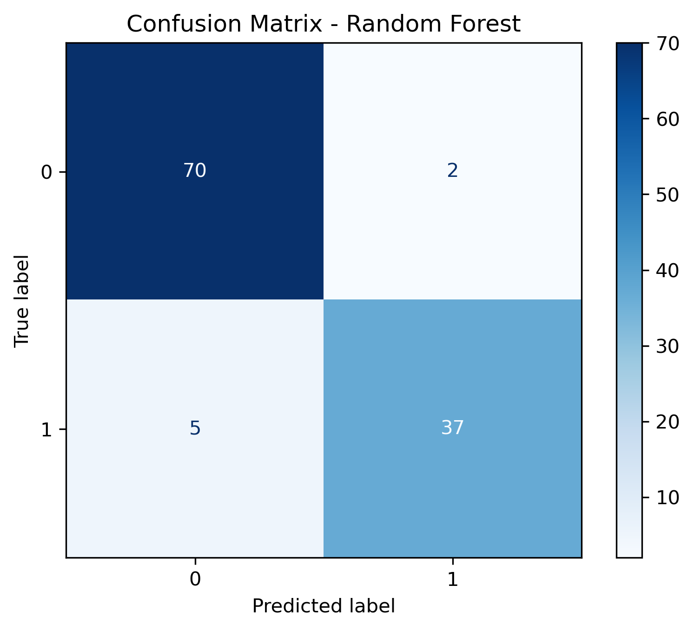
</p>

### Support Vector Machine (SVM)
The SVM model was trained using the radial basis function (RBF) kernel, which is well-suited for non-linear classification tasks. Prior to training, the dataset was scaled using standardization.
<p align="center">
  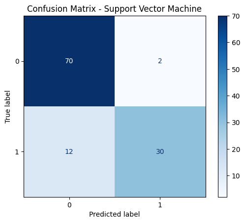
</p>

### K-Nearest Neighbours (KNN)
The KNN classifier was implemented with a k=19 after using the GridSearchCV with 5-fold CV to find the optimal K value. Feature scaling was crucial for this distance-based model. The performance of KNN was evaluated on the same test set used for the other models.
<p align="center">
  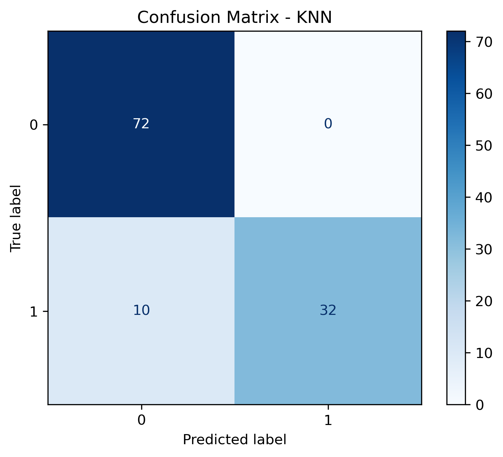
</p>

## Performance Evaluation
The comparative performance metrics of the four classification models showed that the Random Forest model consistently performed better across multiple metrics. It showed the highest accuracy (93.9%), indicating its overall correctness in classification. Moreover, it attained balanced precision (0.949) and recall (0.881) values, resulting in the highest F1 Score (0.91) among the models, reflecting strong performance in both identifying malignant cases and avoiding false positives. The AUC of 0.994 further confirms its excellent discriminatory power between benign and malignant tumors. While Logistic Regression also performed well with an AUC of 0.988 and accuracy of 93%, its recall was slightly lower at 0.83. In contrast, the SVM model showed comparatively weaker performance, particularly in recall (0.71), suggesting a higher rate of missed malignant cases. 
<insert the performance table from four models here>
<p align="center">
  
</p>

The complete table of comparison is below:
<p align="center">
  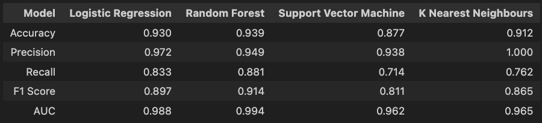
</p>

## Choose The Best Performing Model
Overall, the Random Forest model, which is an ensemble learning method based on constructing multiple decision trees and aggregating their predictions, consistently outperformed the other models across most evaluation criteria, and emerged as the most reliable and well-balanced classifier for this dataset. Given its performance and ability to handle feature interactions and multicollinearity, the Random Forest model was selected as the final model. It was further refined and validated using cross-validation techniques to ensure generalizability and stability before being applied to the testing dataset for final classification.


The final model achieved consistently high AUROC scores across all five folds, ranging from 0.9796 to 0.9969, with a mean cross-validated AUROC of 0.9902, indicating excellent discriminative ability during training. 
When evaluated on the independent test set, the model maintained strong performance with an overall accuracy of 94%. Both classes (benign and malignant) were predicted with high precision and recall resulting in balanced F1-scores of 0.91 and 0.95 for malignant and benign cases, respectively. Additionally, the model achieved an AUROC of 0.9941 on the test set, further confirming its capability to accurately distinguish between the two diagnostic categories. Overall, these results suggest that the breast cancer features can be used to reliably and accurately classify breast cancer from benign nodules using Random Forest model.
<p align="center">
  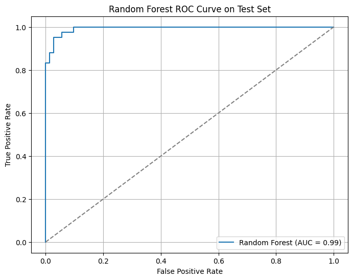
</p>


**Output:**

```text
Cross-validation scores: [0.99303406 0.99690402 0.99690402 0.97961816 0.98477812]
Mean CV score: 0.9902
```

Selected Model: Random Forest Model (RFM)
<p align="center">
  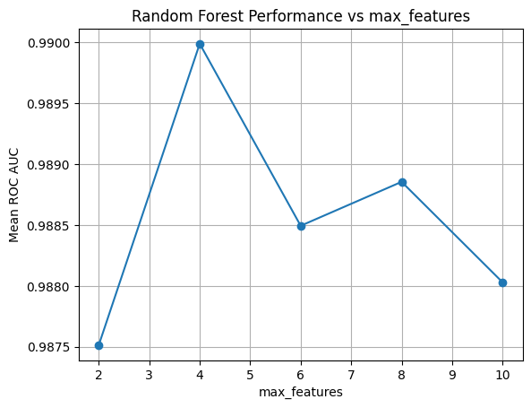
</p>

Why Random Forest Model?
- The Random Forest Model had the highest cross-validation score (mean ≈ 94%), outperforming other models.
- It is more robust to outliers and less sensitive to feature scaling.
- It handles feature importance natively, allowing for deeper insights into the most predictive variables.
- It also showed excellent balance in precision and recall, reducing both false positives and false negatives—crucial in breast cancer diagnosis.


## Top 5 Most Important Features
The Random Forest model provided feature importances that helped identify which features were most influential in making classification decisions. The top 5 most important features in predicting breast cancer (malignant or benign) were:

**Output:**

                                       | Feature               | Importance Score |
                                       |-----------------------|------------------|
                                       | radius mean           | 0.225            |
                                       | concavity worst       | 0.150            |
                                       | concavity mean        | 0.129            |
                                       | radius se             | 0.084            |
                                       | compactness mean      | 0.075            |


<p align="center">
  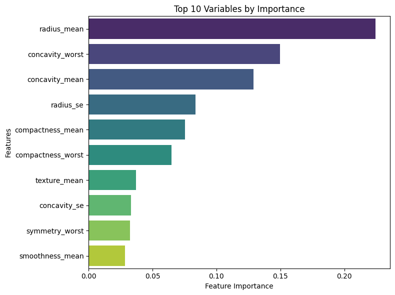
</p>


## Risk Management

The project was a great learning exercise and it truly highlighted how building effective machine learning models goes far beyond algorithm selection. Understanding the data source, identifying its limitations, managing bias and correlation, and selecting the right evaluation metrics are all critical steps toward developing responsible, trustworthy models. Below are some of the risk that we identified with our approach:

1. Dataset Limitations:
The Wisconsin Diagnostic Breast Cancer (WDBC) dataset, widely used in medical research, has key limitations. It contains only 569 samples, limiting representativeness and reliability. A moderate class imbalance (357 benign vs. 212 malignant) may skew results if unaddressed. Originating from a single institution, it carries geographical and institutional bias. Additionally, the dataset includes only precomputed measurements from digitized fine needle aspirates(FNA), not raw images or histopathology slides, restricting its applicaility for advanced diagnostic use.

2. Measurement and Data Acquisition Bias:
The features in this dataset are derived from digitized images, meaning that inconsistencies in measurement devices, individuals involved, resolution and lighting could also affect data quality. This variability can introduce noise, reducing the reliability and repeatability of predictions.

3. Missing Human-centered Attributes from the Data:
While the dataset provides detailed physical features of the tumor cells, it lacks important features such as patient history, genetics, lifestyle factors, and dietary habits. These human-centered attributes can significantly influence diagnostic outcomes and their absence could limit the real-world accuracy and fairness of the model.

4. High Feature Correlation:
The correlation heatmap shows a strong relationship between some of the features in the dataset. Most notably, radius_mean, perimeter_mean, and area_mean are highly correlated with each other, forming a distinct cluster with correlation coefficients close to 1. Similarly, their corresponding “worst” and “SE” measures also show strong correlations. Features such as concavity_mean, concave_points_mean, and compactness_mean are also correlated, indicating they may essentially represent the same information. 
Texture-related features and measures like fractal_dimension_mean and symmetry_se show relatively weak correlations with most other variables. These weaker correlations may point to independent information that could be valuable in prediction models.
This strong multicollinearity among certain groups suggests dimensionality reduction techniques or feature selection might be beneficial for reducing redundancy in subsequent modeling.

## Recommendations

In this analysis, we developed a Random Forest classification model to predict breast cancer diagnosis (malignant or benign) based on 20 diagnostic features. The model demonstrated strong predictive power on the test data, as shown by a balanced confusion matrix and a high AUC, indicating reliable performance in distinguishing malignant from benign cases.

An examination of feature importance revealed that the top five most influential features in predicting malignancy were radius mean, concavity worst, concavity mean, radius se, and compactness mean. These features are related to the shape and size of the cell nuclei and are known to be strongly associated with tumor aggressiveness³. Their prominence in the model is in line with clinical understanding of breast cancer pathology, lending further credibility to the model’s performance.

This machine learning model could be highly beneficial for clinicians and diagnostic centers by providing an automated, accurate, and fast second-opinion tool to assist in early breast cancer detection. When integrated into diagnostic workflows, it can help flag potentially malignant cases for further review, supporting earlier and more targeted interventions. To maximize its benefit, the model should be validated on local clinical data before deployment and used as a decision support system in combination with expert medical judgment.

## Future Considerations

Given more time, we would adopt a more comprehensive approach. Initially, we would apply dimensionality reduction techniques like Principal Component Analysis (PCA) to reduce the dataset's dimensions to 10-15 features. This step would help us address potential feature redundancy, as some of the top features—while not highly correlated—are likely addressing the same underlying dimension of the dataset. By reducing the dimensionality, we could improve the model’s interpretability and possibly uncover new insights that aren’t as apparent in the higher-dimensional space.

After this reduction, we would reintroduce the four models, applying SHAP values to analyze and compare feature importance across all models that performed above 90%. If multiple high-performing models consistently highlight the same features, those are likely the most influential. Features consistently deemed unimportant across models would be strong candidates for exclusion, while those showing mixed importance would warrant deeper investigation.

By adopting this approach, we would not only improve the model’s robustness but also gain a clearer understanding of the most important variables driving our predictions.

# Data Verification

The verification python notebook in the data_verification folder is a simple script used to check the integrity and validity of the data source.
We check that the source - UC Irvine Data Science Machine Learning Repository - still hosts the same dataset we used, for reproducibility.

MD5 hash of the downloaded Zip file: 97da86fb8aa67b905c88ad6c499f6bd4

MD5 hash of the downloaded Data file: c6dd5a2909808f3a901cf00cfd8dfff0

# Commit and Review Approach

We used a different approach to merge changes into the main branch as compared to what was suggested by the course module staff. We createad seperate branches one each for the major artefacts: the report, the python notebook and the data verification. All team members directly merged into these branches and once all of us confirmed to have reviewed the individual artefacts, they were all merged into the main branch. So, some team members may or may not have pull requests and merge requests associated with them as expected by the course module staff. We are grateful to all our team members for the amazing team work and coordination.

# Team members
Below are our team members:
|Name|GitHub|Roles|Contribution Video|
|:--:|:--:|:--:|:--:|
|Sanjeev Budhathoki|https://github.com/budsans | Exploratory data analysis, Model training and evaluation, Report writing| [Video](https://drive.google.com/file/d/1E2SDtxUV082-StzbEPvnVgdvNuJ2Mwfj/view?usp=sharing)|
|Omar Alfaqih|https://github.com/omaralfaqih6/ | Project Management, Documentation, Model Optimization| [Video](https://drive.google.com/file/d/1nTpzZPEA4j_efIYyEyp2j_MPFeziwuiB/view?usp=drive_link)|
|Azhar Hasan|https://github.com/azharhasan|Model Optimization, Risk Analysis, Future Considerations and Documentation| [Video](https://youtu.be/m4cpHjW98Ro)
|Olalekan Oni |https://github.com/oniolalekan |Result Analysis| [Video](https://drive.google.com/file/d/1rBb4gjaVh5DklXJnIpfGGNGRNj6OvbgT/view?usp=sharing)
|Kirby Lin|https://github.com/klin093 | KNN, Data Verification| [Video](https://drive.google.com/file/d/1G_K7FCoXSPmjjCXszI2IaTxFg47RUpbS/view?usp=drive_link)

# Citations

1- Sung H, Ferlay J, Siegel RL, Laversanne M, Soerjomataram I, Jemal A, Bray F. Global Cancer Statistics 2020: GLOBOCAN Estimates of Incidence and Mortality Worldwide for 36 Cancers in 185 Countries. CA: A Cancer Journal for Clinicians. 2021;71(3):209–249. https://doi.org/10.3322/caac.21660

2- Geron, A. (2019). Hands-On Machine Learning with Scikit-Learn, Keras, and TensorFlow (2nd ed.). O’Reilly Media.

3- Elston CW, Ellis IO. Pathological prognostic factors in breast cancer. I. The value of histological grade in breast cancer: experience from a large study with long-term follow-up. Histopathology. 1991;19(5):403–410. https://doi.org/10.1111/j.1365-2559.1991.tb00229.x.


