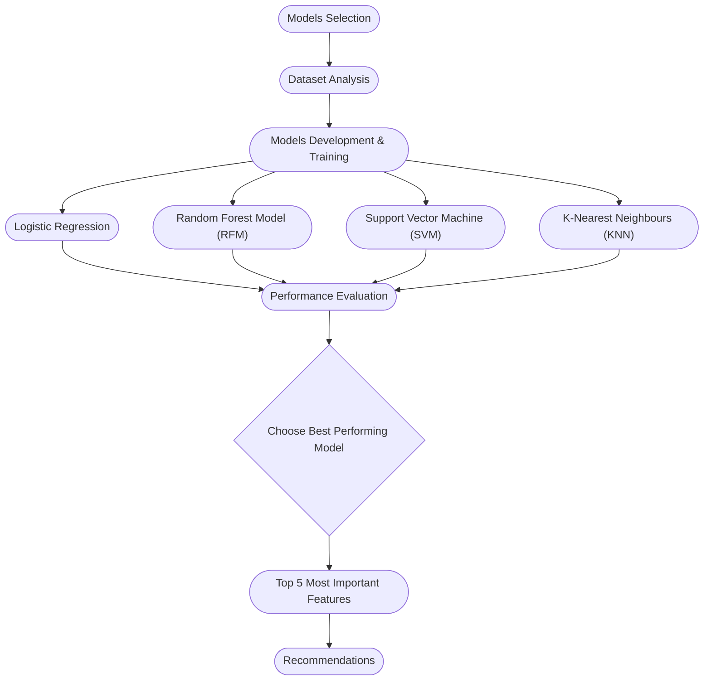

# Improving Breast Cancer Diagnostics Project

Introduction and Objective
Breast cancer remains the most commonly diagnosed malignancy among women worldwide and is a leading cause of cancer-related mortality, accounting for over two million new cases annually. Accurate early diagnosis is essential for improving patient outcomes and reducing treatment-associated morbidity. Traditional diagnostic methods-relying on imaging (e.g., mammography, ultrasound) followed by biopsy—are time-consuming, resource-intensive, and may yield ambiguous results, particularly in women with dense breast tissue. These limitations can lead to diagnostic delays, unnecessary biopsies, or missed malignancies, especially in settings with limited access to specialized radiologists or pathologists (Ref: Sung H, Ferlay J, Siegel RL, Laversanne M, Soerjomataram I, Jemal A, Bray F. Global Cancer Statistics 2020: GLOBOCAN Estimates of Incidence and Mortality Worldwide for 36 Cancers in 185 Countries. CA: A Cancer Journal for Clinicians. 2021;71(3):209–249. https://doi.org/10.3322/caac.21660). 

Machine learning (ML) models offer a promising solution to these challenges by enabling automated, fast, and accurate classification of breast tumors using structured clinical or imaging data. Unlike traditional rule-based systems, ML algorithms can learn complex patterns in large datasets and continuously improve with more data. 

The objective of this analysis is to develop and evaluate classification models for predicting breast cancer diagnosis using the Wisconsin Diagnostic Breast Cancer (WDBC) dataset. 

## Content

[Business Case](https://github.com/omaralfaqih6/breast_cancer_wisconsin/blob/main/README.md#business-case)<br>
[Stakeholders](https://github.com/omaralfaqih6/breast_cancer_wisconsin/blob/main/README.md#stakeholders)<br>
[Project Goals](https://github.com/omaralfaqih6/breast_cancer_wisconsin/blob/main/README.md#project-goals)<br>
[Project Flow Chart](https://github.com/omaralfaqih6/breast_cancer_wisconsin/blob/main/README.md#project-flow-chart)<br>
[Project Report](https://github.com/omaralfaqih6/breast_cancer_wisconsin/blob/main/README.md#project-report)<br>
[Risk Management](https://github.com/omaralfaqih6/breast_cancer_wisconsin/blob/main/README.md#risks-identified--considerations)<br>
[Recommendations](https://github.com/omaralfaqih6/breast_cancer_wisconsin/blob/main/README.md#recommendations)<br>
[Future Considerations](https://github.com/omaralfaqih6/breast_cancer_wisconsin/blob/main/README.md#future-considerations)<br>
[Team Members](https://github.com/omaralfaqih6/breast_cancer_wisconsin/blob/main/README.md#team-members)<br>

# Business Case
Our business case is focused on leveraging data using machine learning models and methodologies to investigate and find the features of a breast mass which are the most predictive of breast cancer diagnosis.

# Stakeholders
After investigating and analyzing the medical field, we had found that below are the primary stakeholders benefitting from this initiative:
|Stakeholder|Interest|
|:-----:|------|
|Patients|Patients are at the top of the list as their life is dependent on the accuracy of the diagnosis. The more accurately diagnosed, patients will receive the required treatment in the shortest period of time, and may be the reason for saving their lives in certain cases.|
|Clinical doctors|Their interest in the project is knowing the most important features required to predict the cancer will increase the accuracy of diagnosis whether its malignant or benign. Which will lead to better treatment/management for the patients.|
|Medical Equipment Manufactors|This initiative will enable the manufacturers building more optimized diagnostic panels for collecting the data.|
|Hospital Management|The management is interested in reducing the diagnostics costs and consequently the patient's treatment. This goal of this initiative is firmly aligned with this interest as finding the most important features will result in a more optimized diagnostic approach. This will consequently lead to more accurate diagnostics, better treatment and reduced cost.|
|Hospital's Legal department | The more optimized diagnostics approach will increase the accuracy of the diagnostic, thereby, avoiding the lawsuits against doctors and the hospital due to consequences of false diagnosis.|
|Ministry of Health|The accurate diagnostics will reduce the cost and the expenses paid by the public health budget.|

# Project Goals
The goal of the project is to identify features that are most predictive of malignant cancer in the Wisconsin Breast Cancer dataset. The dataset features approximately 30 predictor variables associated with each sample. Therefore, The project team shall aim to: 
 - Explore various models to identify 4 models best fit for the problem.
 - Build 4 models using different machine learning techniques and compare their performance.
 - Identify 3-5 features that are the most definitive contributor to the model performance from multiple different models.

# Project Flow Chart
To have a better visualization of the project phases and milestones, our project team had created the below flow chart. In every section, the project team will provide the detailed analysis following the logical flow of the process:


# Project Report

## Models Selection
Our project team had completed a research on the qualified machine learning models to be used for classifying the dataset. The team had listed 6 potential ML models listed below:
  - logistic regression
  - Support Vector Machine (SVM)
  - Random Forest Model (RFM)
  - K-Nearest Neighbours (KNN)
  - AutoGloun
  - LightGBM

Among these listed models, the team had chosen 4 models for our project. These models are the best fit for small datasets and we will conduct our research and analysis in the upcoming sections:
 - logistic regression
 - Support Vector Machine (SVM)
 - Random Forest Model (RFM)
 - K-Nearest Neighbours (KNN)


## Dataset Analysis
The Wisconsin Diagnostic Breast Cancer (WDBC) dataset was designed to distinguish between benign and malignant tumors using image-derived features. It contains 569 patient records and 32 variables, including an ID, diagnosis label, and 30 numeric features computed from fine‑needle aspirate (FNA) images of breast masses. Each of the 30 features represents three summary statistics (mean, standard error, and the “worst” or largest value) across 10 nuclear characteristics such as radius, texture, perimeter, area, smoothness, compactness, concavity, concave points, symmetry, and fractal dimension.

[!NOTE]
> The project team read this article that mentioned the comparison between the 5 models that are most suitable and fit for this dataset. The article is found [here](https://www.data-cowboys.com/blog/which-machine-learning-classifiers-are-best-for-small-datasets)


Distribution of Diagnosis Outcomes
The dataset consists of a total of 569 instances of breast cancer, categorized into malignant (M) and benign (B) tumors. Out of these, 357 cases (62.7%) are benign and 212 cases (37.3%) are malignant. 
<p align="center">
  
</p>
#
- M: for malignant
- B: for benign

> [!NOTE]
> The dataset was downloaded and its analysis were done based on information provided in [Breat Cancer Wisconsin (Diagnostic) paper](https://archive.ics.uci.edu/dataset/17/breast+cancer+wisconsin+diagnostic)

### Dataset Cleanup check
An assessment of missing values across all variables in the dataset revealed that there are no missing values in any column. This ensures the dataset is complete and suitable for downstream analyses without the need for imputation or data cleaning related to missingness.

Distribution of Features
Histograms of all 30 numerical features reveal a variety of distribution shapes, highlighting key characteristics of the dataset. Most features, including area_mean, perimeter_mean, radius_mean, and their corresponding worst and standard error measures, show right-skewed distributions, indicating a concentration of smaller values with a long tail toward larger values. Similarly, features like concavity_mean, compactness_mean, and concave_points_mean are reflecting that a majority of tumors exhibit low levels of these measures. Some other features such as texture_mean, symmetry_mean, and fractal_dimension_mean are more symmetrically distributed. 

### Correlation Analysis
The correlation heatmap shows a strong relationship between some of the features in the dataset. Most notably, radius_mean, perimeter_mean, and area_mean are highly correlated with each other, forming a distinct cluster with correlation coefficients close to 1. Similarly, their corresponding “worst” and “SE” measures also show strong correlations. Features such as concavity_mean, concave_points_mean, and compactness_mean are also correlated, indicating they may essentially represent the same information. 
Texture-related features and measures like fractal_dimension_mean and symmetry_se show relatively weak correlations with most other variables. These weaker correlations may point to independent information that could be valuable in prediction models. Overall, the strong correlation among some of the features suggests dimensionality reduction techniques or feature selection might be beneficial for reducing redundancy and or reducing multicollinearity issues in the subsequent modeling.


#### Correlation between features by cancer status
The plot shows the relationships among the five most correlated features with breast cancer diagnosis (radius_mean, perimeter_mean, radius_worst, area_worst, and perimeter_worest), with samples stratified by diagnostic outcome (malignant vs. benign). Briefly, tumour characteristics such as, radius_mean, perimeter_mean, and area_worst showed a strong linear or almost linear association with the malignancy, consistent with the expectation that larger tumor dimensions correlate with malignancy. Additionally, malignant cases predominantly occupied higher value ranges across all features compared to benign cases, with minimal overlap in distributions. This suggests robust discriminative power of these features.


Distribution of features by cancer status
The boxplot shows the distribution of 12 features between malignant and benign breast tumor cases. Overall, almost all the features except the fractal_dimension_mean, showed higher higher values in malignant cases compared to benign cases.


## Model Development & Training
In the exploratory analysis, we observed that several features in the dataset were highly correlated. This high correlation indicates strong relationships among certain features, which can lead to redundancy in the dataset and could also introduce multicollinearity issues during model training or downstream analysis. Multicollinearity can distort the interpretation of model coefficients, particularly in models like logistic regression, and may also lead to overfitting in more complex models. To address this, we implemented a correlation thresholding approach where one feature from each highly correlated pair (correlation > 0.90) was removed. This step helps in ensuring that each retained feature contributes unique information to the model while also improving interpretability and robustness of our predictive models.

We performed literature review to identify the most suitable classification algorithm for breast cancer diagnosis using the WDBC dataset. We identified four commonly used classifiers: Logistic Regression, Random Forest, Support Vector Machine (SVM) and KNN. We trained each model on the preprocessed training dataset and assessed their performance on the test set. 

The performance of a classification model was evaluated using the following metrics:

### Precision:
The proportion of correctly predicted positive observations to all predicted positives. High precision indicates a low false positive rate. It is measured as:
Precision = (True Positives)/(True Positives + False Positives)

### Recall: 
The proportion of correctly predicted positives out of all actual positives. It is measured as:
Recall = (True Positives)/(True Positives + FalseNegatives)

### F1-Score:
The harmonic mean of precision and recall. It balances both metrics and is especially useful when classes are imbalanced. It is measured as:
F1 =  2 x (Precision x Recall)/(Precision+Recall)

AUROC Curve (Area under the Receiver Operating Characteristic Curve):
Receiver Operating Characteristic Curve is a graphical representation of the diagnostic ability of a binary classifier by plotting the True Positive Rate (Recall) against the False Positive Rate (FPR = FP / (FP + TN)) at various threshold levels. A model that performs better than random guessing will have a curve that bows towards the top-left corner. AUC (Area Under the ROC Curve) is a value summarizing the entire ROC curve. AUC ranges from 0 to 1 and a higher AUC value reflects better model performance.

Reference: Geron, A. (2019). Hands-On Machine Learning with Scikit-Learn, Keras, and TensorFlow (2nd ed.). O’Reilly Media.

The subsections below describe the Python implementation and evaluation approach for each model.

### Logistic Regression
The Logistic Regression model was trained using scikit-learn's LogisticRegression class. The data was split using stratified train-test splitting to ensure balanced class representation. Feature scaling was applied to normalize the inputs.


### Random Forest Model (RFM)
The Random Forest Classifier was trained using scikit-learn’s RandomForestClassifier. This ensemble method uses multiple decision trees to improve prediction accuracy and control overfitting.


### Support Vector Machine (SVM)
The SVM model was trained using the radial basis function (RBF) kernel, which is well-suited for non-linear classification tasks. Prior to training, the dataset was scaled using standardization.


### K-Nearest Neighbours (KNN)
The KNN classifier was implemented with a default k=5. Feature scaling was crucial for this distance-based model. The performance of KNN was evaluated on the same test set used for the other models.


## Performance Evaluation
The comparative performance metrics of the four classification models showed that the Random Forest model consistently performed better across multiple metrics. It showed the highest accuracy (96.5%), indicating its overall correctness in classification. Moreover, it attained balanced precision and recall values of 0.953, resulting in the highest F1 Score (0.953) among the models, reflecting strong performance in both identifying malignant cases and avoiding false positives. The AUC of 0.994 further confirms its excellent discriminatory power between benign and malignant tumors. While Logistic Regression also performed well with an AUC of 0.992 and accuracy of 95.6%, its recall was slightly lower at 0.930. In contrast, the SVM model showed comparatively weaker performance, particularly in recall (0.837), suggesting a higher rate of missed malignant cases. 
<insert the performance table from four models here>


## Choose The Best Performing Model
Overall, the Random Forest model, which is an ensemble learning method based on constructing multiple decision trees and aggregating their predictions, consistently outperformed the other models across most evaluation criteria, and emerged as the most reliable and well-balanced classifier for this dataset. Given its performance and ability to handle feature interactions and multicollinearity, the Random Forest model was selected as the final model. It was further refined and validated using cross-validation techniques to ensure generalizability and stability before being applied to the testing dataset for final classification.


The final model achieved consistently high AUROC scores across all five folds, ranging from 0.9776 to 0.9964, with a mean cross-validated AUROC of 0.9852, indicating excellent discriminative ability during training. 
When evaluated on the independent test set, the model maintained strong performance with an overall accuracy of 96%. Both classes (benign and malignant) were predicted with high precision and recall—97% for benign and 95% for malignant cases—resulting in balanced F1-scores of 0.97 and 0.95, respectively. Additionally, the model achieved an AUROC of 0.9941 on the test set, further confirming its capability to accurately distinguish between the two diagnostic categories. Overall, these results suggest that the breast cancer features can be used to reliably and accurately classify breast cancer from benign nodules using Random Forest model.


**Output:**

```text
Cross-validation scores: [0.96491228 0.94736842 0.98245614 0.96491228 0.96460177]
Mean CV score: 0.9648505778822908
```

Selected Model: Random Forest Model (RFM)


Why Random Forest Model?
- The Random Forest Model: had the highest cross-validation score (mean ≈ 96.5%), outperforming the other models.
- It is more robust to outliers and less sensitive to feature scaling.
- It handles feature importance natively, allowing for deeper insights into the most predictive variables.
- It also showed excellent balance in precision and recall, reducing both false positives and false negatives—crucial in breast cancer diagnosis.


## Top 5 Most Important Features
The Random Forest model provided feature importances that helped identify which features were most influential in making classification decisions. The top 5 most important features in predicting breast cancer (malignant or benign) were:

**Output:**

| Feature               | Importance Score |
|-----------------------|------------------|
| worst concave points  | 0.155            |
| worst perimeter       | 0.138            |
| worst radius          | 0.132            |
| mean concave points   | 0.110            |
| mean perimeter        | 0.080            |


## Risk Management

The project was a great learning exercise and it truly highlighted how building effective machine learning models goes far beyond algorithm selection. Understanding the data source, identifying its limitations, managing bias and correlation, and selecting the right evaluation metrics are all critical steps toward developing responsible, trustworthy models. Below are some of the risk that we identified with our approach:

1. Sample Dataset Limitations:
The Wisconsin Diagnostic Breast Cancer (WDBC) dataset, commonly used in medical research, has several notable limitations. It includes only 569 samples, which restricts its representativeness and can lead to less reliable results. 
The dataset also has a moderate class imbalance, with 357 benign and 212 malignant cases, potentially skewing outcomes toward the majority class if not addressed. 
Moreover, it originates from a single institution—the University of Wisconsin Hospitals—introducing geographical and institutional bias that may not reflect diverse patient populations.

Additionally, The dataset lacks imaging data, providing only precomputed measurements from digitized fine needle aspirate (FNA) samples, such as texture, smoothness, and symmetry, rather than raw images or histopathology slides. 
This limits its applicability for advanced diagnostic techniques. It also excludes patient demographic details, such as age, genetic factors, or family history, which are critical for personalized diagnostics or subgroup analysis.

2. High Feature Correlation:
The correlation heatmap shows a strong relationship between some of the features in the dataset. Most notably, radius_mean, perimeter_mean, and area_mean are highly correlated with each other, forming a distinct cluster with correlation coefficients close to 1. Similarly, their corresponding “worst” and “SE” measures also show strong correlations. Features such as concavity_mean, concave_points_mean, and compactness_mean are also correlated, indicating they may essentially represent the same information. 
Texture-related features and measures like fractal_dimension_mean and symmetry_se show relatively weak correlations with most other variables. These weaker correlations may point to independent information that could be valuable in prediction models.
This strong multicollinearity among certain groups suggests dimensionality reduction techniques or feature selection might be beneficial for reducing redundancy in subsequent modeling.

3. Missing Human-centered Attributes from the Data:
While the dataset provides detailed physical features of the tumor cells, it lacks important features such as patient history, genetics, lifestyle factors, and dietary habits. These human-centered attributes can significantly influence diagnostic outcomes and their absence could limit the real-world accuracy and fairness of the model.

4. Measurement and Data Acquisition Bias:
The features in this dataset are derived from digitized images, meaning that inconsistencies in measurement devices, individuals involved, resolution and lighting could also affect data quality. This variability can introduce noise, reducing the reliability and repeatability of predictions.

5. Model Selection and Evaluation Strategy:
While the original study used MSM-T, we evaluated several modern models, including logistic regression, decision trees, support vector machines (SVM) and KNN. To handle uncertainty and improve robustness, we performed cross-validation and hyperparameter tuning across different algorithms.
In a medical context where accuracy alone is not enough, we used metrics like precision, recall, F1-score, and ROC-AUC, especially to minimize false negatives, where a malignant tumor might be misclassified as benign—an outcome that carries serious clinical risk.

6. Dependency on Data Quality:
Most machine learning models are highly sensitive to the quality and structure of the training data. Noise, missing values, and inconsistent feature scaling can significantly reduce model performance. We ensured rigorous data cleaning, normalization, and outlier handling in our preprocessing pipeline to mitigate this risk.


## Recommendations

In this analysis, we developed a Random Forest classification model to predict breast cancer diagnosis (malignant or benign) based on 20 diagnostic features. The model demonstrated strong predictive power on the test data, as shown by a balanced confusion matrix and a high AUC, indicating reliable performance in distinguishing malignant from benign cases.

An examination of feature importance revealed that the top five most influential features in predicting malignancy were worst concave points, mean concave points, worst perimeter, worst radius, and worst area. These features are related to the shape and size of the cell nuclei and are known to be strongly associated with tumor aggressiveness. Their prominence in the model is in line with clinical understanding of breast cancer pathology, lending further credibility to the model’s performance.

This machine learning model could be highly beneficial for clinicians and diagnostic centers by providing an automated, accurate, and fast second-opinion tool to assist in early breast cancer detection. When integrated into diagnostic workflows, it can help flag potentially malignant cases for further review, supporting earlier and more targeted interventions. To maximize its benefit, the model should be validated on local clinical data before deployment and used as a decision support system in combination with expert medical judgment.

## Future Considerations

In our current approach, we selected one model out of the four we tested and identified the top five features based on that model’s performance. However, the models we evaluated had very similar performance levels. If we treat each model as a subject matter expert, then choosing one over the others means favoring a single expert while overlooking others with nearly equal track records.

Given more time, we would have taken a more holistic approach by analyzing feature importance across all models that achieved over 90% performance. Specifically, we would calculate and compare SHAP values for each of these models to identify features that are consistently important across the board. The idea is that if multiple high-performing models agree on certain features, those are likely to be genuinely influential. Features deemed unimportant by all models would be strong candidates for exclusion, while those with mixed importance rankings would warrant further investigation.

We would also have complemented this analysis with interviews or discussions with subject matter experts to better understand the context and relevance of these variables. Their insights could help validate the model findings and align them with existing research or real-world patterns.


# Team members
Below are our team members:
|Name|GitHub|Roles|Contribution Video|
|:--:|:--:|:--:|:--:|
|Sanjeev Budhathoki|https://github.com/budsans | Exploratory data analysis, Model training and evaluation, Report writing|
|Omar Alfaqih|https://github.com/omaralfaqih6/ | Documentation, Model Optimization|
|Azhar Hasan|https://github.com/azharhasan|Model Optimization, Risk Analysis|
|Olalekan Oni |https://github.com/oniolalekan |Result Analysis|
|Kirby Lin|https://github.com/klin093 | KNN, Proofreading| 

